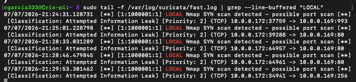
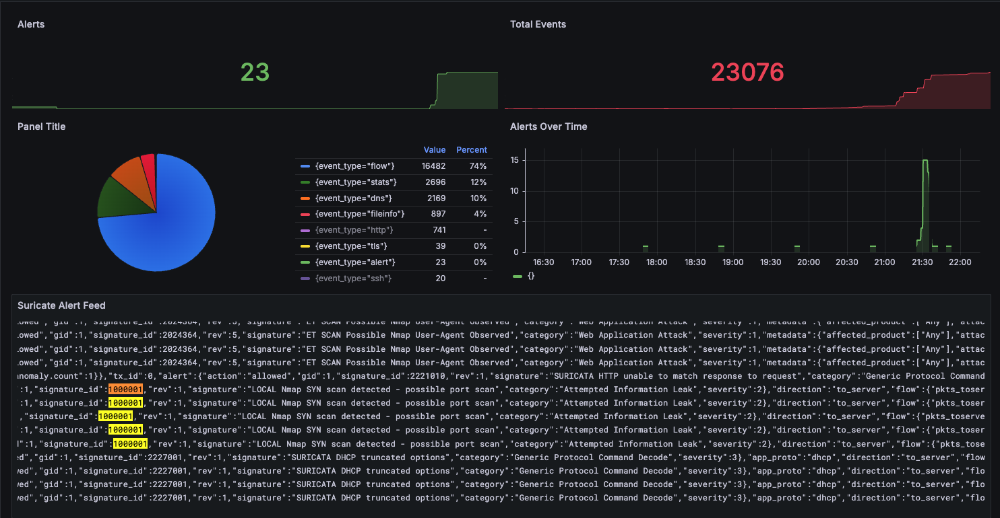

# Investigation 01 — Port Scan Detection

## Summary

I ran a port scan against my own Pi to prove my lab could detect it. At first nothing alerted, even though Suricata was clearly seeing the traffic. I traced it to two problems: my custom rule was never saved to a file Suricata loads, and once fixed, the rule's direction logic didn't match a scan coming from inside my own network. After correcting both, my rule (SID 1000001) caught the scan and I confirmed it in `fast.log` and `eve.json`.

## Setup

Scanning from my laptop (10.0.0.172) against the Pi (10.0.0.169) on my home network (10.0.0.0/24). Suricata watches `wlan0`, and alerts flow through Suricata → eve.json → Promtail → Loki → Grafana. I used Nmap for the scan.

## The Rule

```
alert tcp any any -> $HOME_NET any (msg:"LOCAL Nmap SYN scan detected - possible port scan"; flags:S; flow:to_server; threshold:type both, track by_src, count 20, seconds 10; classtype:attempted-recon; sid:1000001; rev:1;)
```

It only fires if one source sends 20+ SYN packets in 10 seconds. That threshold is how I separate a real scan from normal traffic — a webpage is a few SYNs, a port sweep is hundreds fast.

## Evidence

From `fast.log`:

```
07/07/2026-21:24:31  [1:1000001:1] LOCAL Nmap SYN scan detected - possible port scan [Priority: 2] {TCP} 10.0.0.172:37759 -> 10.0.0.169:993
```

Key `eve.json` fields: `signature_id` 1000001, `src_ip` 10.0.0.172, `dest_ip` 10.0.0.169, `category` Attempted Information Leak, `severity` 2.





## What Happened and Why It Failed

The scan was reconnaissance — knocking on every port to see what's open, the usual first move before an attack. It maps to **MITRE ATT&CK T1046 (Network Service Discovery)**.

Two root causes for the missed detection:

First, the rule file was missing. Suricata's config pointed at `local.rules` but the file didn't exist, so it was skipped at startup. The clue was a flow log showing `"alerted": false` on traffic that was clearly being captured — that told me it was a rule problem, not a capture problem.

Second, a direction mismatch. The rule was written `$EXTERNAL_NET -> $HOME_NET` (outside to inside), but I was testing from my own laptop inside `HOME_NET`, so it never matched. Switching the source to `any` fixed it for internal testing. (The `EXTERNAL_NET -> HOME_NET` form is correct for a real internet-based scan.)

## Impact

Recon only, no exploitation. Suricata was in detect mode so it logged the scan but didn't block it, and my nftables firewall (default-deny) already limits exposure. Low risk, but in the real world a scan like this usually precedes a targeted attack, so it's worth watching for follow-up from the same source.

*Authorized testing on equipment I own.*
